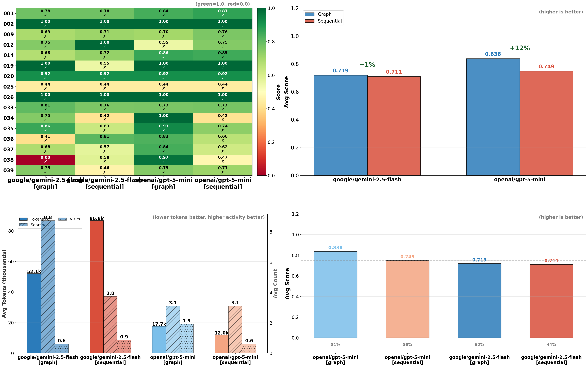
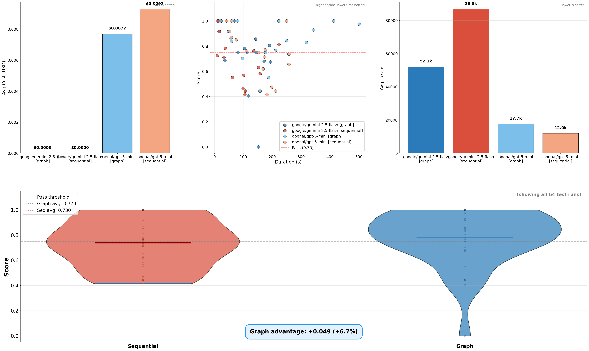

# Euglena

A scalable Graph-of-Thoughts (GoT) agent service for web research using task decomposition and parallel reasoning to increase accuracy and reduce cost. 

Euglena is an agent with web crawling and retrieval-augmented generation. Tasks decompose into parallel subproblems (search, visit, save, think) and merge into structured deliverables. Context persists in ChromaDB. Cost efficiency is maximized through dynamic beam-width and a token-efficient workflow that benefits cheaper models through structured reasoning.

**Live:** <https://euglena.vercel.app/>

**Ops (2026-03):** Project is winding down. Production uses a local backend instead of AWS: ECS deploy scripts in-repo still work if needed.

## Benchmark Results

64 runs across 16 tests x 2 models x 2 execution variants.

### Graph vs Sequential

Graph-of-Thought scores **26.8% higher** than sequential and uses **29% fewer tokens**.

| Metric | Graph | Sequential | Delta | % Change |
|---|---|---|---|---|
| Avg Score | **0.921** | 0.727 | +0.195 | **+26.8%** |
| Pass Rate | **90.6%** | 46.9% | +43.8pp | |
| Avg Cost | **$0.04** | $0.06 | -$0.01 | -22.5% |
| Avg Tokens | **22.6k** | 32.0k | -9.4k | -29.3% |
| Avg Duration | 688s | **349s** | +339s | +97.2% |




### Overall Leaderboard

| Rank | System | Avg Score | Median | Std | Pass % | $/run | Time |
|---|---|---|---|---|---|---|---|
| 1 | **gpt-5.2 [graph]** | **0.930** | 0.979 | 0.094 | **93.8%** | $0.07 | 471s |
| 2 | gpt-5-mini [graph] | 0.912 | 0.931 | 0.097 | 87.5% | $0.01 | 904s |
| 3 | gpt-5.2 [sequential] | 0.729 | 0.746 | 0.172 | 50.0% | $0.09 | 200s |
| 4 | gpt-5-mini [sequential] | 0.724 | 0.697 | 0.164 | 43.8% | $0.03 | 497s |

### Efficiency



## Features

- **Graph-of-Thought reasoning**: Tasks decompose into parallel subproblems (search, visit, think, save), then merge results upward through the DAG into structured deliverables
- **Dual execution modes**: `graph` (parallel branching with best-first selection) and `sequential` (generate then pick, single path depth first) for A/B comparison
- **Bot-resistant web access**: Primary `aiohttp` connector with automatic `undetected-chromedriver` fallback on 403/401
- **Long-term memory (RAG)**: Crawled content is chunked and embedded into ChromaDB, queryable across tasks and reasoning steps
- **Dynamic beam width**: Branching factor adapts to score quality. Expands exploration when scores are low, narrows when confident
- **Deduplication and pruning**: Candidate thoughts are deduplicated by embedding similarity. Low-scoring nodes are pruned to save budget
- **Elastic worker fleet**: ECS autoscaling matches demand via CloudWatch queue-depth metrics, winds down when idle
- **User-scoped quotas**: Supabase enforces per-user daily usage limits with JWT authentication
- **Comprehensive test suite**: 39 priority-ordered tests with programmatic and LLM-based validation

## Observability

Structured telemetry at every layer without cluttering business logic.

| Layer | What Is Tracked | Where |
|---|---|---|
| **Connectors** | Every HTTP request, LLM call, search query, browser fetch. Timing, status, payload size | `ConnectorBase._record_timing`, `_record_io` |
| **AgentIO** | Unified interface telemetry. Visit/search/store/retrieve with fallback tracking | `AgentIO` methods |
| **Engine** | Step-by-step DAG traversal. Expansion, evaluation, selection, merge, pruning events | `IdeaDagEngine` logger |
| **GoT Operations** | Embedding, deduplication hits, dynamic beam decisions, prune events | `GoTOperations` |
| **Memory** | Chunk storage, retrieval counts, namespace isolation | `MemoryManager` |
| **Test Runner** | Per-test scores, pass/fail, cost, tokens, duration, graph structure metrics | `idea_test_runner.py` |
| **Visualization** | 4-page core dashboard, heatmaps, efficiency frontiers, difficulty rankings | `testing/visualization_*` |

Connector base classes handle I/O logging so action classes stay focused on logic (see [OOP conventions](.cursor/rules/oop.mdc)).

### Test and Visualization Pipeline

```
idea_test_runner  >  JSON results  >  visualization_summary  >  terminal report
                                   >  visualization_core     >  4-page PNG dashboard
                                   >  visualization_plots    >  detailed plot gallery
```

Results are written to `agent/idea_test_results/` as timestamped JSON. The visualizer can filter by run ID (`--latest`, `--run-id`) and generates executive dashboards, heatmaps, efficiency frontiers, and per-test breakdowns.

**Regenerating Visualizations:**

```bash
# From services/ directory, run visualization in Docker
docker compose run --rm agent python -m app.testing.idea_test_visualize --latest --core-only

# Or generate all plots (including detailed gallery)
docker compose run --rm agent python -m app.testing.idea_test_visualize --latest

# List available test runs
docker compose run --rm agent python -m app.testing.idea_test_visualize --list-runs

# Generate and copy benchmark plots to docs/benchmark/ (from project root)
python scripts/generate_benchmark_plots.py
```

**Visualization Improvements:**
- **Executive Summary**: Score heatmap (test × system) replaces model leaderboard table for better visual insight
- **Efficiency Dashboard**: Violin plots with all datapoints replace cramped tables, showing full score distributions
- **Larger fonts**: All text increased for better readability (titles 32-48pt, labels 18-22pt)
- **All datapoints visible**: Individual test runs shown as scatter points overlaid on distributions
- **Clear trends**: Graph vs Sequential advantage highlighted with annotations and visual comparisons

Visualizations are automatically generated after test runs and saved to `agent/idea_test_results/plots_<run_id>/`.

## Tech Stack

| Layer | Technology |
|---|---|
| Frontend | React, Vite, Supabase Auth |
| Backend | FastAPI, RabbitMQ, Redis, ChromaDB, Supabase |
| Agent | Graph-of-Thought engine, OpenAI LLMs, Brave Search, undetected-chromedriver |
| Infra | AWS ECS, ECR, CloudWatch, Lambda autoscaling; optional local Docker |

## Quick Start

### Production (AWS)

Use the existing ECS deploy path. If `VITE_GATEWAY_URL` is unset, the app uses the default hosted API URL in `frontend/src/api/config.ts`.

### Local backend (Docker) and Vercel UI

Same Supabase keys. Run the stack without nginx:

```bash
cd services
cp keys.env.example keys.env
docker compose -f docker-compose.yml -f docker-compose.local.yml up -d --build --scale agent=3
```

Or: `python scripts/deploy_local_stack.py up` from the repo root.

Run `tailscale funnel --bg --yes 18080`, set `VITE_GATEWAY_URL` on Vercel to the printed HTTPS URL, redeploy.

Optional static UI on this host (nginx on port 80):

```bash
python scripts/deploy_local_stack.py build-frontend
python scripts/deploy_local_stack.py up-spa
```

Start on boot (systemd): from `services/` run `./install-webrag-service.sh` once (sets `WorkingDirectory` and enables `webrag.service`). Build images before first boot: `docker compose -f docker-compose.yml -f docker-compose.local.yml build`.

### Local Development

```bash
cd services
cp keys.env.example keys.env
docker compose up -d
```

- Frontend (Vite): `http://localhost:5173`
- Gateway: `http://localhost:8080`
- RabbitMQ UI: `http://localhost:15672` (guest/guest)
- ChromaDB: `http://localhost:8001`

### Running Tests

```bash
# Run specific tests
IDEA_TEST_IDS=019,025 docker compose run --profile test visit-test

# Run full test suite
docker compose run --profile test idea-test

# Benchmark mode (top 8 tests, 3 models, 3 runs each)
IDEA_TEST_MODE=benchmark docker compose run --profile test idea-test
```

### Environment Variables

Key environment variables for testing:
- `IDEA_TEST_IDS`: Comma-separated test IDs (e.g., "019,025,033")
- `IDEA_TEST_MODE`: "default" or "benchmark"
- `IDEA_TEST_RUNS`: Number of runs per test/model pair
- `IDEA_TEST_CONCURRENCY`: Max parallel executions
- `IDEA_TEST_MODELS`: Comma-separated models (e.g., "gpt-5.2,gpt-5-mini")
- `IDEA_TEST_EXECUTION_VARIANTS`: "graph", "sequential", or both

## Repo Layout

```
services/
  agent/          Agent service (GoT engine, connectors, tests)
  gateway/        FastAPI gateway, task intake, Supabase sync
  shared/         Connector configs, models, storage helpers
  metrics/        CloudWatch queue-depth publisher
  lambda_autoscaling/  ECS autoscaler
frontend/         React web UI
scripts/          Deployment, diagnostics, audits
docs/             Architecture, security, benchmark plots
```

## Documentation

- [System Architecture](docs/ARCHITECTURE.md) - Overall system design and message flow
- [Agent Architecture](services/agent/app/AGENT_ARCHITECTURE.md) - Graph-of-Thought engine internals
- [Test Suite](services/agent/app/idea_tests/README.md) - Test structure and validation
- [Deployment](services/agent/app/DEPLOYMENT.md) - Deployment guide
- [Debugger](services/agent/app/AGENT_DEBUG.md) - Debugging tools and techniques
- [Scripts](scripts/README.md) - Deployment and diagnostic scripts
