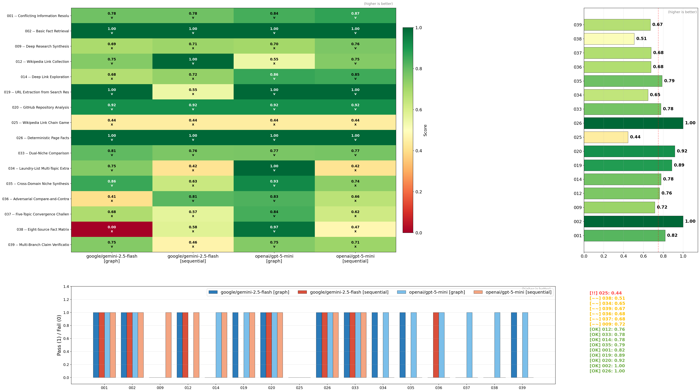
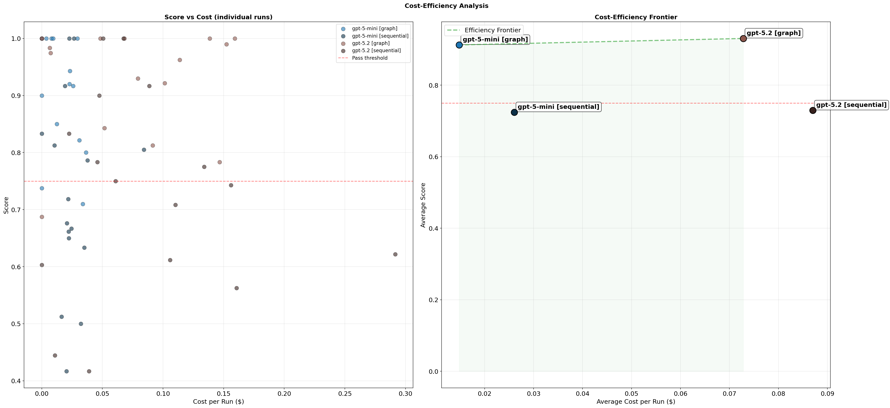

# Euglena AI

Agentic AI platform with Graph-of-Thought reasoning, web crawling, and retrieval-augmented generation. Tasks decompose into parallel subproblems (search, visit, save, think), execute concurrently, and merge into structured deliverables. Context persists in ChromaDB. Cost efficiency is maximized through dynamic beam width and token-efficient workflows.

**Live:** <https://web-rag-nine.vercel.app/>

## Benchmark Results

64 runs across 16 tests x 2 models x 2 execution variants.


### Overall Leaderboard

| Rank | System | Avg Score | Median | Std | Pass % | $/run | Time |
|---|---|---|---|---|---|---|---|
| 1 | **gpt-5.2 [graph]** | **0.930** | 0.979 | 0.094 | **93.8%** | $0.07 | 471s |
| 2 | gpt-5-mini [graph] | 0.912 | 0.931 | 0.097 | 87.5% | $0.01 | 904s |
| 3 | gpt-5.2 [sequential] | 0.729 | 0.746 | 0.172 | 50.0% | $0.09 | 200s |
| 4 | gpt-5-mini [sequential] | 0.724 | 0.697 | 0.164 | 43.8% | $0.03 | 497s |

### Graph vs Sequential

Graph-of-Thought scores **26.8% higher** than sequential and uses **29% fewer tokens**.

| Metric | Graph | Sequential | Delta | % Change |
|---|---|---|---|---|
| Avg Score | **0.921** | 0.727 | +0.195 | **+26.8%** |
| Pass Rate | **90.6%** | 46.9% | +43.8pp | |
| Avg Cost | **$0.04** | $0.06 | -$0.01 | -22.5% |
| Avg Tokens | **22.6k** | 32.0k | -9.4k | -29.3% |
| Avg Duration | 688s | **349s** | +339s | +97.2% |

### Per-Model Graph Advantage

| Model | Graph Score | Sequential Score | Delta Score | Graph Pass% | Seq Pass% | Delta Pass% |
|---|---|---|---|---|---|---|
| gpt-5.2 | **0.930** | 0.729 | +0.201 (+27.6%) | **93.8%** | 50.0% | +43.8pp |
| gpt-5-mini | **0.912** | 0.724 | +0.188 (+26.0%) | **87.5%** | 43.8% | +43.8pp |

### Score Heatmap (Test x System)



### Efficiency


| System | Score/1M tok | $/point |
|---|---|---|
| gpt-5-mini [graph] | 35.23 | $0.02 |
| gpt-5.2 [graph] | **48.01** | $0.08 |
| gpt-5-mini [sequential] | 21.75 | $0.04 |
| gpt-5.2 [sequential] | 23.74 | $0.12 |

### Cost-Efficiency Frontier



## What It Does

- **Graph-of-Thought reasoning**: tasks decompose into parallel subproblems (search, visit, think, save), then merge results upward through the DAG into structured deliverables
- **Dual execution modes**: `graph` (parallel branching with best-first selection) and `sequential` (generate then pick, single path depth first) for A/B comparison
- **Bot-resistant web access**: primary `aiohttp` connector with automatic `undetected-chromedriver` fallback on 403/401
- **Long-term memory (RAG)**: crawled content is chunked and embedded into ChromaDB, queryable across tasks and reasoning steps
- **Dynamic beam width**: branching factor adapts to score quality. Expands exploration when scores are low, narrows when confident
- **Deduplication and pruning**: candidate thoughts are deduplicated by embedding similarity. Low-scoring nodes are pruned to save budget
- **Elastic worker fleet**: ECS autoscaling matches demand via CloudWatch queue-depth metrics, winds down when idle
- **User-scoped quotas**: Supabase enforces per-user daily usage limits with JWT authentication

## Observability

Structured telemetry at every layer without cluttering business logic.

| Layer | What Is Tracked | Where |
|---|---|---|
| **Connectors** | Every HTTP request, LLM call, search query, browser fetch. Timing, status, payload size | `ConnectorBase._record_timing`, `_record_io` |
| **AgentIO** | Unified interface telemetry. Visit/search/store/retrieve with fallback tracking | `AgentIO` methods |
| **Engine** | Step-by-step DAG traversal. Expansion, evaluation, selection, merge, pruning events | `IdeaDagEngine` logger |
| **GoT Operations** | Embedding, deduplication hits, dynamic beam decisions, prune events | `GoTOperations` |
| **Memory** | Chunk storage, retrieval counts, namespace isolation | `MemoryManager` |
| **Test Runner** | Per-test scores, pass/fail, cost, tokens, duration, graph structure metrics | `idea_test_runner.py` |
| **Visualization** | 4-page core dashboard, heatmaps, efficiency frontiers, difficulty rankings | `testing/visualization_*` |

Connector base classes handle I/O logging so action classes stay focused on logic (see [OOP conventions](.cursor/rules/oop.mdc)).

### Test and Visualization Pipeline

```
idea_test_runner  >  JSON results  >  visualization_summary  >  terminal report
                                   >  visualization_core     >  4-page PNG dashboard
                                   >  visualization_plots    >  detailed plot gallery
```

Results are written to `agent/idea_test_results/` as timestamped JSON. The visualizer can filter by run ID (`--latest`, `--run-id`) and generates executive dashboards, heatmaps, efficiency frontiers, and per-test breakdowns.

## Tech Stack

| Layer | Technology |
|---|---|
| Frontend | React, Vite, Supabase Auth |
| Backend | FastAPI, RabbitMQ, Redis, ChromaDB, Supabase |
| Agent | Graph-of-Thought engine, OpenAI LLMs, Brave Search, undetected-chromedriver |
| Infra | AWS ECS, ECR, CloudWatch, Lambda autoscaling |

## Quick Start

```bash
cd services
cp keys.env.example keys.env   # add OPENAI_API_KEY + SEARCH_API_KEY
docker compose up -d
docker compose run --profile test visit-test
```

### Local Development

The frontend automatically detects local development mode and uses Docker resources:

1. **Start Docker services**: `cd services && docker compose up -d`
2. **Start frontend dev server**: `cd frontend && npm run dev`
3. The frontend will automatically connect to `http://localhost:8080` (Docker gateway)

**Override behavior:**
- Set `VITE_GATEWAY_URL` to use a specific gateway URL
- Set `VITE_USE_LOCAL=true` to force local mode even in production builds
- Set `VITE_USE_LOCAL=false` to disable auto-detection

## Repo Layout

```
services/
  agent/          Agent service (GoT engine, connectors, tests)
  gateway/        FastAPI gateway, task intake, Supabase sync
  shared/         Connector configs, models, storage helpers
  metrics/        CloudWatch queue-depth publisher
  lambda_autoscaling/  ECS autoscaler
frontend/         React web UI
scripts/          Deployment, diagnostics, audits
docs/             Architecture, security, benchmark plots
```

## Docs

- [Agent Architecture](services/agent/app/AGENT_ARCHITECTURE.md)
- [Deployment](services/agent/app/DEPLOYMENT.md)
- [Debugger](services/agent/app/AGENT_DEBUG.md)
- [Test Suite](services/agent/app/idea_tests/README.md)
- [System Architecture](docs/ARCHITECTURE.md)
- [Security](docs/SECURITY.md)
- [Scripts](scripts/README.md)
