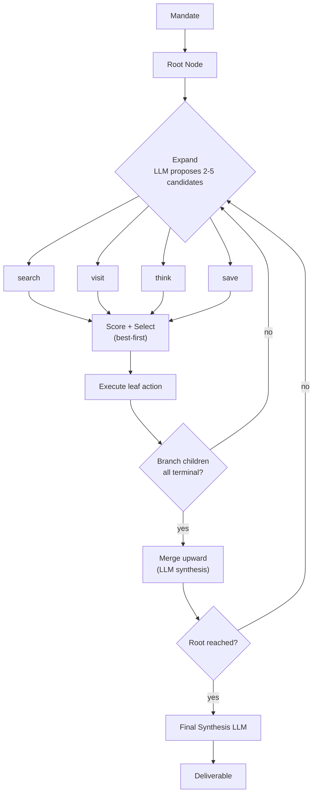
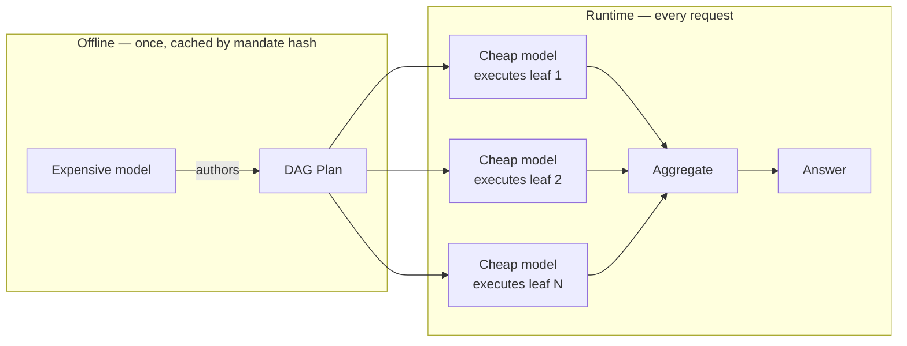
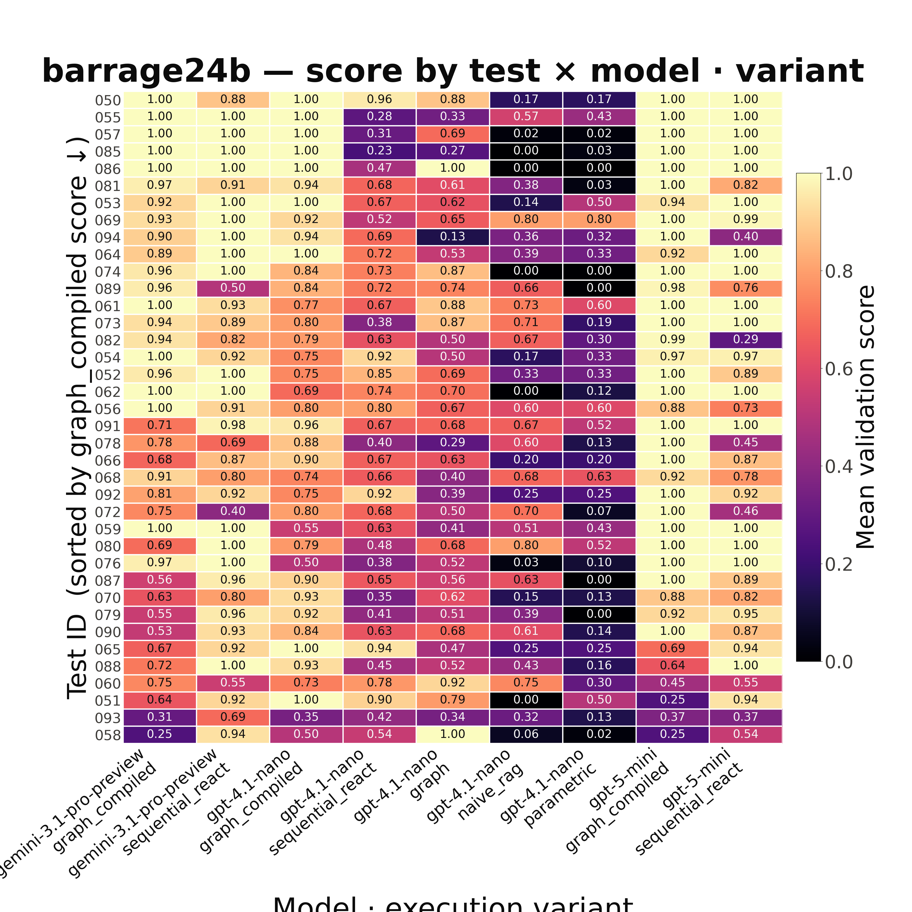
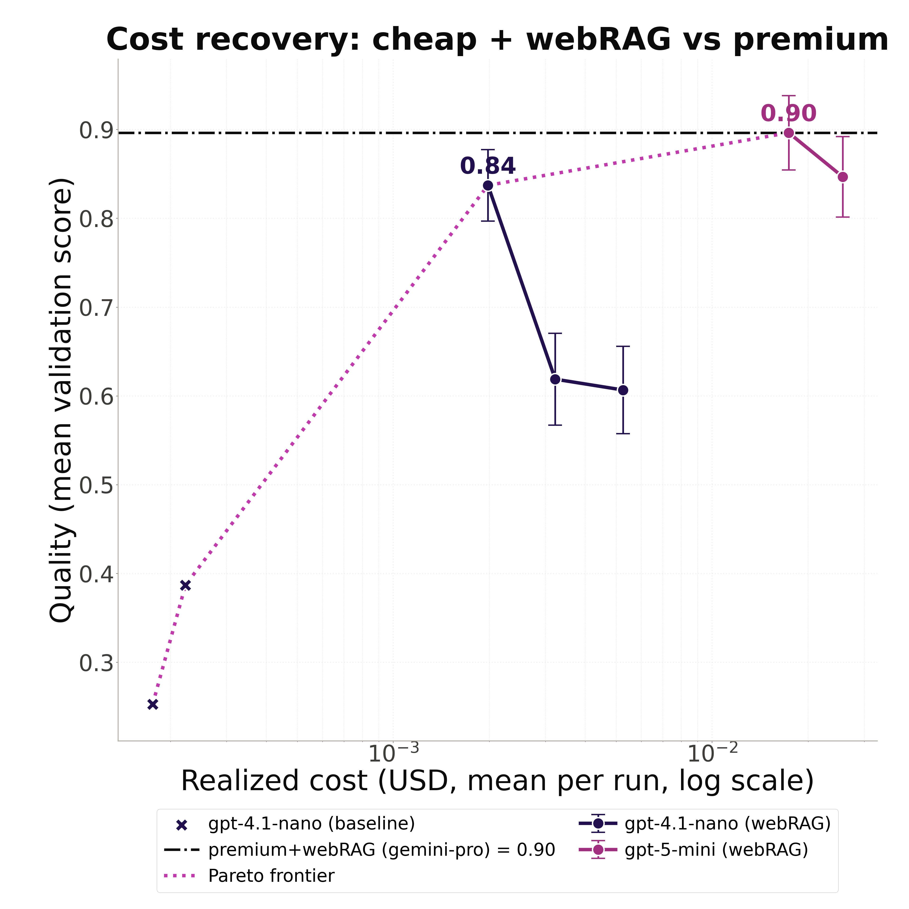
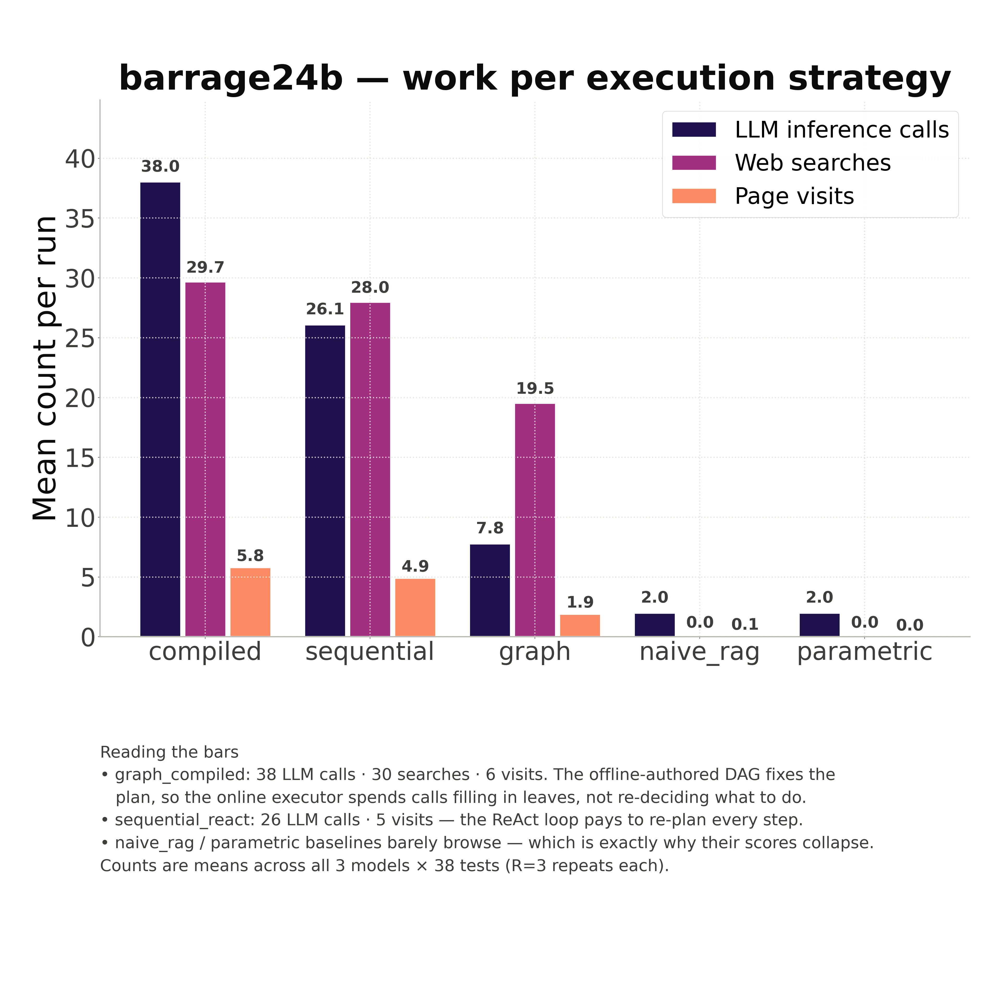
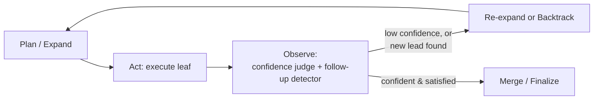

# Euglena

A scalable Graph-of-Thoughts (GoT) agent service for web research using task decomposition and parallel reasoning to increase accuracy and reduce cost. 

Euglena is an agent with web crawling and retrieval-augmented generation. Tasks decompose into parallel subproblems (search, visit, save, think) and merge into structured deliverables. Context persists in ChromaDB. Cost efficiency is maximized through dynamic beam-width and a token-efficient workflow that benefits cheaper models through structured reasoning.

**Live:** <https://euglena.vercel.app/>

**Ops (2026-03):** The Euglena product is winding down. Current production runs on the **local
backend** (this host, via Docker Compose + Tailscale Funnel), not AWS — see Quick Start below. The
ECS/ECR/CloudWatch deploy path remains in-repo and functional as a secondary/legacy option, not
the documented default anymore.

## How It Works

Every request becomes a **mandate**, which is a free-form research question handed to a controller
(`IdeaDagEngine`) that owns a directed acyclic graph (DAG) of "thought" nodes and a ChromaDB
memory. It decomposes, acts, and merges until it has an answer:


```mermaid
flowchart TD
    A[Mandate] --> B[Root Node]
    B --> C{"Expand<br/>LLM proposes 2-5 candidates"}
    C --> D1[search]
    C --> D2[visit]
    C --> D3[think]
    C --> D4[save]
    D1 --> E["Score + Select<br/>(best-first)"]
    D2 --> E
    D3 --> E
    D4 --> E
    E --> F[Execute leaf action]
    F --> G{"Branch children<br/>all terminal?"}
    G -- no --> C
    G -- yes --> H["Merge upward<br/>(LLM synthesis)"]
    H --> I{Root reached?}
    I -- no --> C
    I -- yes --> J[Final Synthesis LLM]
    J --> K[Deliverable]
```

Everything expensive is an LLM call the graph disciplines: **expand** (plan candidates),
**evaluate** (score them), **merge** (synthesize a branch), **finalize** (write the deliverable).
Everything else — dependency edges, dedup, dynamic beam width, pruning, retries, checkpointing —
is deterministic Python keeping those calls grounded. Full internals:
[Idea Engine Deep Dive](agent/app/IDEA_ENGINE.md).

## Two things live in this repo

1. **Euglena, the product:** a hosted GoT web-research agent (frontend, gateway, quotas, auth),
   winding down and kept running on the local backend in low-maintenance mode.
2. **The adaptive-engine research line:** an actively-developed research platform (built
   on top of the same agent engine). It started with the compiled scaffold below, the project's
   first big benchmark result, then pivoted to porting those lessons into the live DAG loop
   itself as opt-in adaptive mechanisms (see Notes further down). This is where current
   development effort goes; see `docs/handoffs/HANDOFF.md` for the latest committed session-by-session state.
   The **Benchmark Results** section right below documents the closed-out compiled-scaffold
   proof — not the product, and not the still-running adaptive-engine A/B.

## Versioning

This repo's architecture comes in named generations, referenced throughout these docs and in the
Timeline below:

| Name | Landed | What it is |
|---|---|---|
| **DAG v1** | 2026-02 → 03 | The original Graph-of-Thought rewrite — live LLM calls at every expand/evaluate/merge step, with no offline-authored plan. |
| **Compiled v1** | 2026-06 | An expensive model authors a full DAG plan once, offline; a cheap model executes that fixed plan on every request (see Benchmark Results below). |
| **DAG v2** | 2026-07 → present | The current native-DAG improvement series, built on DAG v1's base loop, porting Compiled v1's planning lessons back in as opt-in adaptive mechanisms (see Notes below). |
| **v3** | planned | Moves past one-shot mandates toward a more continuable, chatbot-like interaction; folds in codebench and additional tool/capability work deferred out of v2. |
| **Euglena Ledger** | 2026-08-31 → present | A scoped pivot out of DAG v2: an auditable, replayable evidence compiler that emits verified claims, deterministic derivations, and an ANSWER/PARTIAL/ABSTAIN verdict. A component other agents call, not a general agentic framework. See [docs/LEDGER.md](docs/LEDGER.md). |

**Why the emphasis stays on native DAG work, not compiled:** Compiled v1 authors a plan with one
expensive LLM call and reuses it, using pre-computed structure as its mechanism. Compared to DAG
v1/v2's native reasoning, compiled trades adaptability for a narrower, harder-to-validate gain — a
fixed plan can't react to what a step actually reveals, and testing it well means testing every
plan shape it can produce. Native DAG improvements generalize across more tasks, stay easier to
test, and make the more interesting story to explain, in interviews and in these docs. DAG v2
treats a compiled layer as one adjustable option among several.

**The library, not a hand-edited prompt:** the concrete form that layer takes inside DAG v2 is a
small, general-purpose library of prompt and reasoning guidance
([`agent/app/strategy_library/`](agent/app/strategy_library/notes/README.md),
[`agent/app/plan_library/`](agent/app/plan_library/)) — pitfalls to watch for, phrasing that
avoids known failure modes, the kind of thing that used to mean hand-editing a prompt every time a
benchmark run exposed a new weak spot. Formalizing that editing into a library lets it improve
over time and get reused across tasks instead of living only in one prompt's edit history. It
stays deliberately small: one general-purpose snippet applicable to many kinds of benchmark
question, not one written guide per question — `strategy_library/`'s promotion gate (held out on
≥2 tasks, ≥5% uplift) exists specifically to keep it that way.

**The goal, restated:** raise the reasoning and agentic performance of cheaper models on publicly
available endpoints until they're competitive with more expensive models. There are many candidate
mechanisms for this — structure, memory, voting, calibration, compiled or native planning, and
more still being tried — and the constraint that keeps them honest is cost: whatever a mechanism
costs to run must stay cheaper than just calling the more expensive model directly, or it hasn't
earned its place.

## Benchmark Results — Compiled v1 (closed-out proof, 2026-06/07)

**The compiled scaffold thesis:** instead of letting a cheap model improvise its own research
plan step-by-step, let an expensive model author an execution plan (a DAG:
which sub-facts to gather, in what order, what depends on what) **once, offline**. A cheap model
executes that fixed plan **live, on every request**. The plan is the expensive part, paid for
once and reused forever; the part that runs on every request is cheap.


```mermaid
flowchart LR
    subgraph Offline["Offline — once, cached by mandate hash"]
        X[Expensive model] -->|authors| P[DAG Plan]
    end
    subgraph Runtime["Runtime — every request"]
        P --> W1["Cheap model<br/>executes leaf 1"]
        P --> W2["Cheap model<br/>executes leaf 2"]
        P --> W3["Cheap model<br/>executes leaf N"]
        W1 --> AG[Aggregate]
        W2 --> AG
        W3 --> AG
        AG --> ANS[Answer]
    end
```

1,026 live runs (`barrage24b`, ≈$38 real OpenRouter spend) across 38 hand-designed discriminating
tasks x 3 models x 3 repeats, comparing the compiled scaffold (`graph_compiled`) against a native
graph-of-thoughts build-it-yourself baseline, a plain ReAct loop (`sequential_react`), and
tool-free baselines (`naive_rag`, `parametric`).

| Model | Strategy | Score | Cost/task |
|---|---|---|---|
| **gpt-4.1-nano** (cheapest) | compiled plan | **0.837** | **$0.002** |
| **gpt-5-mini** (mid-tier) | compiled plan | **0.896** | **$0.017** |
| **gemini-3.1-pro** (premium, the reference ceiling) | best baseline | 0.896 | $0.169 |

The mid-tier model, given the compiled plan, **exactly matches** the premium model's score at
**10% of the cost**. The cheapest model reaches 93% of premium quality at **~1/85th the cost**.
This holds up under real statistics, not just a favorable average: on the hardest task tier, the
compiled scaffold beats the plain ReAct baseline with a 95% confidence-interval-disjoint
significant margin (n=270 runs per arm).



### Cost recovery



### Efficiency — how much work each strategy actually does

The compiled scaffold spends its LLM calls filling in a fixed plan's leaves, not re-deciding
what to do next at every step — which is why it's both cheaper AND more consistent than a
from-scratch ReAct loop on the harder tasks.



Full package (9 charts, raw + aggregated CSVs, significance tables, honest caveats) lives in
[`linkedin_package_38tests_2026-07-08/`](linkedin_package_38tests_2026-07-08/README_LINKEDIN.md).

## Notes: DAG v2 — The Native Adaptive Engine (in progress)

**Compiled v1** above proved what a good plan buys you: it authors that plan once, offline, using
an expensive model, and executes it live with a cheap one. **DAG v2** ports those lessons into the
native, non-compiled engine so it reasons adaptively mid-run: plan → act → **observe the step** →
decide the next move (re-expand, backtrack, or stop) — reacting to what a step actually reveals,
which a fixed offline plan can't do. (Compiled v1 is available inside DAG v2 as an optional,
small-scope layer — see Versioning above.)


```mermaid
flowchart LR
    P["Plan / Expand"] --> Ac["Act: execute leaf"]
    Ac --> Ob["Observe:<br/>confidence judge + follow-up detector"]
    Ob -->|"low confidence, or<br/>new lead found"| Re["Re-expand or Backtrack"]
    Re --> P
    Ob -->|"confident & satisfied"| Mg["Merge / Finalize"]
```

Every mechanism ships **opt-in and default-off, byte-identical to prior behavior when disabled**:
confidence-gated re-expansion, a follow-up detector, backtrack on dead-end chains, reasoning-effort
discipline for reasoning models, and price-tier-aware token budgets. Architecture, flag inventory,
and lessons learned: [`agent/app/ADAPTIVE_ENGINE.md`](agent/app/ADAPTIVE_ENGINE.md).

**Status:** nothing adaptive is proven yet — that's what the current "ladder benchmark" is for: a
paired A/B (`baseline` → `good_adaptive`) testing whether a cheap model (`gpt-5-mini`) burning more
of its own tokens via the adaptive loop closes part of the accuracy gap to a strong reference model.
A first full run was stopped after surfacing a ChromaDB concurrency hang plus several fairness and
statistical-validity bugs; the fix set (32 items across driver safety, model reliability, infra
fairness, validator correctness, and the grounding/re-expansion gate) is landed, offline-tested
(1,951 passed / 18 skipped / 0 failed), and — as of a 2026-08-14 targeted live smoke — confirmed to
actually resolve the deadlock in a real run. The full barrage relaunch is unblocked; running it is
the next step, and this section gets its own results once it has.

## Features

- **Graph-of-Thought reasoning**: Tasks decompose into parallel subproblems (search, visit, think, save), then merge results upward through the DAG into structured deliverables
- **Dual execution modes**: `graph` (parallel branching with best-first selection) and `sequential` (generate then pick, single path depth first) for A/B comparison
- **Bot-resistant web access**: Primary `aiohttp` connector with automatic `undetected-chromedriver` fallback on 403/401
- **Long-term memory (RAG)**: Crawled content is chunked and embedded into ChromaDB, queryable across tasks and reasoning steps
- **Dynamic beam width**: Branching factor adapts to score quality. Expands exploration when scores are low, narrows when confident
- **Deduplication and pruning**: Candidate thoughts are deduplicated by embedding similarity. Low-scoring nodes are pruned to save budget
- **Elastic worker fleet**: ECS autoscaling matches demand via CloudWatch queue-depth metrics, winds down when idle (legacy/secondary deploy path — see Quick Start; current production scales via `docker compose ... --scale agent=N` on the local backend)
- **User-scoped quotas**: Supabase enforces per-user daily usage limits with JWT authentication
- **Comprehensive test suite**: 151 priority-ordered task modules (`agent/app/idea_tests/`) with programmatic and LLM-based validation, plus a 1,951-passed/18-skipped/0-failed offline `pytest` suite (`agent/tests/`); 38 of the tasks are the curated, live-verified discriminators used in the compiled-scaffold benchmark above, and a further 24 ("adaptive-targeted", `test_122`–`test_145`) discriminate the adaptive engine across four decision archetypes

## Observability

Structured telemetry at every layer without cluttering business logic.

| Layer | What Is Tracked | Where |
|---|---|---|
| **Connectors** | Every HTTP request, LLM call, search query, browser fetch. Timing, status, payload size | `ConnectorBase._record_timing`, `_record_io` |
| **AgentIO** | Unified interface telemetry. Visit/search/store/retrieve with fallback tracking | `AgentIO` methods |
| **Engine** | Step-by-step DAG traversal. Expansion, evaluation, selection, merge, pruning events | `IdeaDagEngine` logger |
| **GoT Operations** | Embedding, deduplication hits, dynamic beam decisions, prune events | `GoTOperations` |
| **Memory** | Chunk storage, retrieval counts, namespace isolation | `MemoryManager` |
| **Test Runner** | Per-test scores, pass/fail, cost, tokens, duration, graph structure metrics | `idea_test_runner.py` |
| **Visualization** | 4-page core dashboard, heatmaps, efficiency frontiers, difficulty rankings | `testing/visualization_*` |

Connector base classes handle I/O logging so action classes stay focused on logic (see [OOP conventions](.cursor/rules/oop.mdc)).

### Test and Visualization Pipeline

```
idea_test_runner  >  JSON results  >  visualization_summary  >  terminal report
                                   >  visualization_core     >  4-page PNG dashboard
                                   >  visualization_plots    >  detailed plot gallery
```

Results are written to `agent/idea_test_results/` as timestamped JSON (gitignored, not a repo-root directory). The visualizer can filter by run ID (`--latest`, `--run-id`) and generates executive dashboards, heatmaps, efficiency frontiers, and per-test breakdowns.

**Regenerating Visualizations:**

```bash
# From services/ directory, run visualization in Docker
docker compose run --rm agent python -m app.testing.idea_test_visualize --latest --core-only

# Or generate all plots (including detailed gallery)
docker compose run --rm agent python -m app.testing.idea_test_visualize --latest

# List available test runs
docker compose run --rm agent python -m app.testing.idea_test_visualize --list-runs

# Generate and copy benchmark plots to docs/benchmark/ (from project root)
python scripts/generate_benchmark_plots.py
```

**Visualization Improvements:**
- **Executive Summary**: Score heatmap (test × system) replaces model leaderboard table for better visual insight
- **Efficiency Dashboard**: Violin plots with all datapoints replace cramped tables, showing full score distributions
- **Larger fonts**: All text increased for better readability (titles 32-48pt, labels 18-22pt)
- **All datapoints visible**: Individual test runs shown as scatter points overlaid on distributions
- **Clear trends**: Graph vs Sequential advantage highlighted with annotations and visual comparisons

### Compiled-Scaffold Benchmark Gallery (`barrage24b`)

The docker-based pipeline above works on any test run. The compiled-scaffold campaign (the
Benchmark Results above) has its own dedicated, $0-to-regenerate gallery pipeline, run locally
against the on-disk result JSONs — no docker, no live model calls:

```bash
PYTHONPATH=.:services:agent python3 scripts/render_gallery.py
```

Reads every `barrage24b_*.json` under `agent/idea_test_results/`, writes 9 square 4K
(3840×3840) PNGs plus raw/aggregated CSVs to `agent/idea_test_results/barrage24b_gallery/`
(`scripts/bench_common.py` is the shared, run-id-scoped data loader; `agent/app/testing/plot_style.py`
is the shared Magma-family house style — titles/labels/marks are sized to stay readable when the
4K image is viewed small, e.g. embedded in a doc or a slide). The curated, packaged copy for
external sharing is [`linkedin_package_38tests_2026-07-08/`](linkedin_package_38tests_2026-07-08/README_LINKEDIN.md).

Visualizations are automatically generated after test runs and saved to `agent/idea_test_results/plots_<run_id>/`.

## Tech Stack

| Layer | Technology |
|---|---|
| Frontend | React, Vite, Supabase Auth |
| Backend | FastAPI, RabbitMQ, Redis, ChromaDB, Supabase |
| Agent | Graph-of-Thought engine, OpenAI LLMs, web search (Serper/Brave), undetected-chromedriver |
| Infra | Local Docker Compose on-host (current production path, via Tailscale Funnel); AWS ECS, ECR, CloudWatch, Lambda autoscaling remain available as a secondary/legacy path |

## Quick Start

### Production (current: local backend + Vercel UI)

This is the path production actually runs today. Same Supabase keys. Run the stack without nginx:

```bash
cd services
cp keys.env.example keys.env
docker compose -f docker-compose.yml -f docker-compose.local.yml up -d --build --scale agent=3
```

Or: `python scripts/deploy_local_stack.py up` from the repo root.

Run `tailscale funnel --bg --yes 18080`, set `VITE_GATEWAY_URL` on Vercel to the printed HTTPS URL, redeploy.

Optional static UI on this host (nginx on port 80):

```bash
python scripts/deploy_local_stack.py build-frontend
python scripts/deploy_local_stack.py up-spa
```

Start on boot (systemd): from `services/` run `./install-webrag-service.sh` once (sets `WorkingDirectory` and enables `webrag.service`). Build images before first boot: `docker compose -f docker-compose.yml -f docker-compose.local.yml build`.

### Legacy/secondary: AWS ECS

The original production path. Deploy scripts (`scripts/deploy.py`, `deploy_ecs.py`,
`deploy_autoscale.py`, etc.) remain in-repo and functional, but ECS is no longer the documented
default — use it only if you specifically need managed autoscaling infra. If `VITE_GATEWAY_URL`
is unset, the app uses the default hosted API URL in `frontend/src/api/config.ts`.

### Local Development

```bash
cd services
cp keys.env.example keys.env
docker compose up -d
```

- Frontend (Vite): `http://localhost:5173`
- Gateway: `http://localhost:8080`
- RabbitMQ UI: `http://localhost:15672` (guest/guest)
- ChromaDB: `http://localhost:8001`

### Submit Your First Query

With the stack up, submit a mandate and poll for the result. Auth is a Supabase JWT in the
`Authorization` header — obtain one by signing in through the frontend (or your Supabase
project) and use it as `$TOKEN`. (`GATEWAY_TEST_MODE=true` in `keys.env` relaxes the daily
quota check for local dev.)

```bash
# 1. Submit a task -> returns a correlation_id and status "in_queue"
curl -s -X POST http://localhost:8080/tasks \
  -H "Authorization: Bearer $TOKEN" -H "Content-Type: application/json" \
  -d '{"mandate": "Who wrote the novel Beloved, and where did she earn her master'\''s degree?"}'

# 2. Poll until status is "completed".
#    result.deliverables[0] is the answer; result.evidence carries the pages actually
#    visited (sources), the grounding verdict, and the token/cost usage.
curl -s http://localhost:8080/tasks/<correlation_id> -H "Authorization: Bearer $TOKEN"
```

Interactive, auto-generated API docs: <http://localhost:8080/docs>. A runnable end-to-end
client (submit + poll loop, prints the answer + evidence) is in
[`examples/quickstart.py`](examples/quickstart.py).

### Running Tests

Everything below runs from `services/`. No host virtualenv is required.

```bash
# Offline unit/regression suite (~5.8k tests, no API keys, no network, no spend)
docker compose --profile test run --rm agent-test
# ...or one module
docker compose --profile test run --rm agent-test pytest -q agent/tests/got_operations_test.py

# Live task runs against the benchmark suite (these DO use keys.env and spend money)
IDEA_TEST_IDS=019,025 docker compose --profile test run --rm visit-test
docker compose --profile test run --rm idea-test
IDEA_TEST_MODE=benchmark docker compose --profile test run --rm idea-test
```

The equivalent host invocation, for a checkout with a `.venv`, is
`PYTHONPATH=.:services:agent ./.venv/bin/python -m pytest -q agent/tests`. The container run
differs in one respect: `consol` publishes no wheel for the image's Python 3.10, so five
optional-dependency tests skip there.

### Running Benchmarks

```bash
# Compute-ladder A/B against the LOCAL Ollama models ($0). No arguments = dry-run cell plan.
docker compose --profile ladder-benchmark run --rm ladder-benchmark
docker compose --profile ladder-benchmark run --rm ladder-benchmark \
    --run-id ladder_local --axis capspec_local --task-set smoke8 \
    --arms baseline,good_adaptive --jobs 1

# Prompt-shape / calibration micro-eval (also local, also $0)
docker compose --profile promptbench run --rm promptbench --census
docker compose --profile promptbench run --rm promptbench-analyze \
    --runs agent/idea_test_results/promptbench_runs.jsonl
```

Both benchmark services write results to `agent/idea_test_results/` on the host. Set
`LADDER_UID`/`LADDER_GID` (or `PROMPTBENCH_UID`/`PROMPTBENCH_GID`) if your host account is not
uid 1000, so the result files stay writable by a later host-side run.

### Environment Variables

The full registry (required / optional / benchmark-only) is in
[docs/CONFIGURATION.md](docs/CONFIGURATION.md); run `python scripts/list_env_vars.py` for the
authoritative, always-current list scanned from the code.

Key environment variables for testing:
- `IDEA_TEST_IDS`: Comma-separated test IDs (e.g., "019,025,033")
- `IDEA_TEST_MODE`: "default" or "benchmark"
- `IDEA_TEST_RUNS`: Number of runs per test/model pair
- `IDEA_TEST_CONCURRENCY`: Max parallel executions
- `IDEA_TEST_MODELS`: Comma-separated models (e.g., "gpt-5.2,gpt-5-mini")
- `IDEA_TEST_EXECUTION_VARIANTS`: "graph", "sequential", or both

## Repo Layout

```
services/
  agent/          Agent service (GoT engine, connectors, tests)
  gateway/        FastAPI gateway, task intake, Supabase sync
  shared/         Connector configs, models, storage helpers
  metrics/        CloudWatch queue-depth publisher
  lambda_autoscaling/  ECS autoscaler
frontend/         React web UI
scripts/          Deployment, diagnostics, audits
docs/             Architecture, security, benchmark plots
```

## Documentation

- [Configuration](docs/CONFIGURATION.md) - Environment variable registry (required / optional / benchmark-only)
- [System Architecture](docs/ARCHITECTURE.md) - Overall system design and message flow
- [Agent Architecture](agent/app/AGENT_ARCHITECTURE.md) - Graph-of-Thought engine internals
- [Idea Engine Deep Dive](agent/app/IDEA_ENGINE.md) - File-and-line-cited walkthrough of the DAG controller, policies, and mechanics
- [Adaptive Engine](agent/app/ADAPTIVE_ENGINE.md) - The interleaved plan-act-observe-decide loop, flag inventory, and lessons learned
- [Research Library](agent/app/RESEARCH_LIBRARY.md) - Mechanism-by-mechanism map of what external research each part of the agent matches or diverges from
- [Test Suite](agent/app/idea_tests/README.md) - Test structure and validation
- [Deployment](agent/app/DEPLOYMENT.md) - Deployment guide
- [Debugger](agent/app/AGENT_DEBUG.md) - Debugging tools and techniques
- [Scripts](scripts/README.md) - Deployment and diagnostic scripts

## Timeline

- **2025-10 → 2026-01:** Started as a single-shot LLM `Connector` + CLI; grew a FastAPI gateway, then reached MVP.
- **2026-02 → 2026-03 — DAG v1:** Rewritten around a **Graph-of-Thought DAG engine** — decompose into subproblems, execute `search`/`visit`/`think`/`save` leaves, merge upward (see How It Works above). Native throughout: no offline-authored plan, every expand/evaluate/merge step is a live LLM call. AWS ECS wound down in favor of the local backend (Ops note near the top).
- **2026-05:** Default LLM provider migrated to OpenRouter (note near the top).
- **2026-06 — Compiled v1:** an expensive model authors a DAG plan once, offline; a cheap model executes it live, recovering premium-model accuracy at a fraction of cost (see Benchmark Results above). Alongside it: a duplicate `shared/` module tree and a stale forked engine copy were deleted, and the 1,600+-line engine controller was broken into focused modules.
- **2026-07 → present — DAG v2:** Compiled v1's lessons (structured planning, reasoning-effort discipline) ported into the live, non-compiled DAG loop as opt-in, default-off mechanisms: confidence-gated re-expansion, backtrack, price-tier token budgets (see Notes above and [`ADAPTIVE_ENGINE.md`](agent/app/ADAPTIVE_ENGINE.md)). Currently mid-relaunch of a live cost/accuracy A/B (the "ladder benchmark") testing whether the adaptive loop closes the gap between cheap and premium models. Plan for finishing this generation: a hugely expanded, harder benchmark set than DAG v1's, repeating some of DAG v1's own tasks to measure improvement directly, dropping the sequential-mode comparison arm, and adding a new arm that compares the same model run through an off-the-shelf, publicly available agent system in current use. Codebench and additional tool/capability work are deliberately deferred to v3.
- **2026-08:** **Repo restructure + a repeatable dev-cycle methodology.** `services/agent/` moved to
  a top-level `agent/`, legacy AWS deploy code archived under `services/_legacy-aws/`, and
  `badmodel-lab/codebench/` (the Docker coding-benchmark harness) folded into a top-level
  `codebench/` — both cross-cutting moves fixed real silent-failure bugs (bash root-anchor
  depth-counting, a Python default path that returned `[]` instead of erroring). Work now happens
  directly on `master` (the long-lived `compiled-scaffold-dag` branch was fast-forward-merged in
  and retired) under a repeatable **Plan → Adversarial review → Test → Benchmark → Implement → Run →
  Analyze** loop (`docs/DEV_CYCLE.md`, invoked via the `/cycle` skill) that replaced one-off
  per-session handoff docs. Two live cycles have run; a third pass root-caused and fixed two
  independent silent self-loop deadlocks in the adaptive engine's re-expansion/merge logic (found by
  a live confirmation smoke, not by the offline suite or adversarial review — see
  `docs/handoffs/HANDOFF.md`). Live-verification smokes for that fix and a codebench write-protocol
  fix are the two open threads going into the next cycle.
- **planned — v3:** Move past one-shot mandates toward a more continuable, chatbot-like interaction — stopping mid-run and picking a task back up, rather than only submit-and-wait for a deliverable. Folds in codebench and the tools/capabilities held out of v2. Whether task continuation ships as part of finishing v2 or waits for v3 is still open, to be settled by whichever proves more practical once v2's benchmark work is underway.
